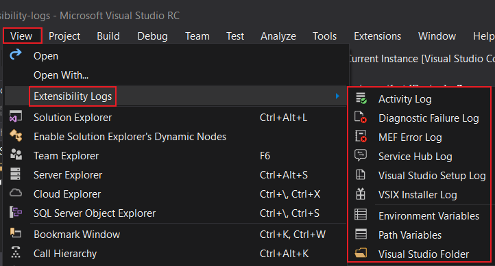

## Toolbar
For those people who prefer their commands front-and-center, available all the time with a single click,
this extension adds a new _Extensibility Logs_ toolbar. You'll need to enable the toolbar before you'll see it.

## Menu
For those people who don't want to add yet another toolbar, this extension also adds a new *Extensibility Logs* menu 
to the _View_ menu.

## Logs

Each of the logs can be individually disabled, or all logs disabled together.

### Activity Log

Opens Visual Studio's _Activity Log_ in a tab in Visual Studio,
without having to first remember where the file is stored,
and then open it in your editor of choice.

- **Folder:** %APPDATA%\Microsoft\VisualStudio\instance_id\
- **File:** ActivityLog.xml

### Diagnostic Failure Log

Opens MSBuild's latest _Diagnostic Failure Log_ in a tab in Visual Studio,
without knowing how to find it first, 
and then open it in your editor of choice.

- **Folder:** %TEMP%
- **Files:** MSBuild_*.failure.log

### MEF Error Log

Opens Visual Studio's _MEF Error Log_ in a tab in Visual Studio,
without having to search for it,
and then open it in your editor of choice.

- **Folder:** %LOCALAPPDATA%\Microsoft\VisualStudio\instance_id\ComponentModelCache
- **File:** Microsoft.VisualStudio.Default.err

### Service Hub Log

Opens the latest _Service Hub Log_ in a tab in Visual Studio,
without first knowing how to it first, 
and then open it in your editor of choice.

- **Folder:** %TEMP%\servicehub\logs 
- **Files:** VsixServiceDiscovery-*.log

### Visual Studio Setup Log

Opens the latest _Visual Studio Setup Log_ in a tab in Visual Studio, scrambling to find it,
and then open it in your editor of choice.

- **Folder:** %TEMP%
- **Files:** dd_setup_*.log

### VSIX Installer Log

Opens the latest _VSIX Installer Log_ in a tab in Visual Studio, 
without knowing what the file's called and how to find it, 
and then open it in your editor of choice.

- **Folder:** %TEMP%
- **Files:** dd_VSIXInstaller_*.log

## Tools

### Environment Variables

Displays the _environment variables_ for the current process in a tab in Visual Studio,
without having to open a command prompt and issue a SET command.

### Path Variables

Displays Windows' current _search paths for executable files_ in a tab in Visual Studio,
without having to open a command prompt.

### Visual Studio Folder

Opens the *current Visual Studio instance's folder* in a *File Explorer* window,
without having to first remember the location of the folder,
and then open it in a File Explorer window.

- **Folder:** %LOCALAPPDATA%\Microsoft\VisualStudio\instance_id\

## Options

Any logs/tools that have been disabled will still appear on the toolbar, but will be inactive,
but they won't appear in the menu.
The toolbar buttons can be hidden by removing them from the _Extensibility Logs_ toolbar.

### General Options

#### Enable Extensibility Logs

This setting allows the whole set of _Extensibility Logs_ features to be turned off together.

#### Version Number

Displays then version number of _Extensibility Logs_ that's currently installed.

### Logs Options

#### Enable Activity Log

The _Activity Log_ feature can be disabled by setting _Tools | Options | Extensibility Logs |  Enable Activity Log_
to `false`.

#### Enable Diagnostic Failure Log

The _Diagnostic Failure Log_ feature can be disabled by setting _Tools | Options | Extensibility Logs | Enable Diagnostic Log_
to `false`.

#### Enable MEF Error Log

The _MEF Error Log_ feature can be disabled by setting _Tools | Options | Extensibility Logs | Enable MEF Error Log_
to `false`.

#### Enable Service Hub Log

The _MEF Error Log_ feature can be disabled by setting _Tools | Options | Extensibility Logs | Enable Service Hub Log_
to `false`.

#### Enable Visual Studio Setup Log

The _Visual Studio Setup Log_ feature can be disabled by setting _Tools | Options | Extensibility Logs | Enable Visual Studio Setup Log_
to `false`.

#### Enable VSIX Installer Log

The _VSIX Installer Log_ feature can be disabled by setting _Tools | Options | Extensibility Logs | Enable VSIX Installer Log_
to `false`.

### Tools Options

#### Enable Environment Variables

The _Environment Variables_ feature can be disabled by setting _Tools | Options | Extensibility Logs | Enable Environment Variables_
to `false`.

#### Enable Path Variables

The _Path Variables_ feature can be disabled by setting _Tools | Options | Extensibility Logs | Enable Path Variables_
to `false`.

#### Enable Visual Studio Folder

The _Visual Studio Folder_ feature can be disabled by setting _Tools | Options | Extensibility Logs | Enable Open Visual Studio Folder_
to `false`.
